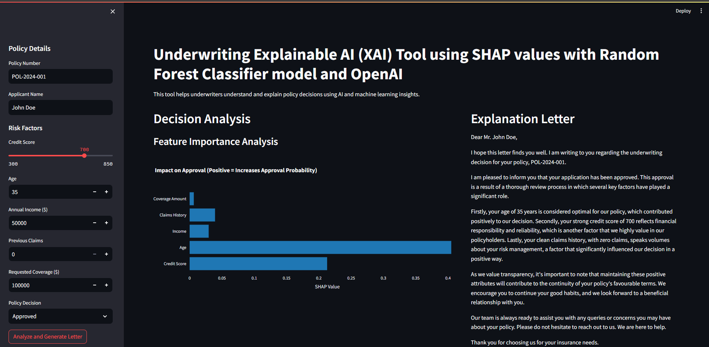

# Underwriting Explainability Tool

All Policy holders deserve to understand why their policies were approved or not. I understand that whether a policy is approved or not, represents the livelihood of someone, and with the innovation in technology and the onset of even underwriting AI assistants, we have the opportunity to ensure transparency to policy holders and clients. 



Thus, I built this tool to serve to provide insight to clients and even underwriters, in addition to exploring the use of Explainable AIs (XAIs). This project is a Streamlit application designed to help underwriters and policy holders understand and explain policy decisions. It uses:

- **Machine Learning (Random Forest)** for basic classification  
- **SHAP (SHapley Additive exPlanations)** to interpret model predictions  
- **OpenAI** for generating a user-friendly explanation letter  

By providing risk factors such as credit score, age, income, claims history, and requested coverage, the app visualizes how these inputs affect policy approval or rejection and generates an explanation letter.

---

## Features

1. **Intuitive Web UI** using [Streamlit](https://streamlit.io/)  
2. **Dynamic Slider and Input Fields** to adjust policy applicant details  
3. **Interactive SHAP Bar Chart** showing feature contributions toward approval or rejection  
4. **Automated Explanation Letter** with the option to download as a PDF or text  
5. **Backend using RandomForestClassifier** and synthetic training data for demonstration

---
## Random Forest Model Decision Trees
```bash
               Credit Score > 650? 
               /          \
           Yes              No
           |                  |
Income > 30K?          Coverage Amount > 500K? 
   |                      |
  Yes                    No 
   |                       |
Approved                 Rejected
```
A decision tree works by making a series of yes/no decisions to reach an outcome. It starts by checking if the credit score is greater than 650. If yes, it then checks if the income is above 30K — if true, the policy is approved; if false, it is rejected. If the credit score is below 650, the model checks if the coverage amount exceeds 500K — if true, the policy is rejected; if false, it is approved. This simple structure helps the model make fast, consistent decisions based on financial stability and risk exposure.

---
## SHAP Values

SHAP values explain how much each input feature (like credit score, income, and coverage amount) influenced the model’s decision to approve or reject a policy. A positive SHAP value means the feature increased the likelihood of approval, while a negative SHAP value means it decreased the likelihood of approval. For example, a high credit score and high income would generate positive SHAP values, pushing the decision toward approval, while a high coverage amount or low income might generate negative SHAP values, pushing the decision toward rejection. SHAP values help break down the decision-making process, providing transparency into why the model reached a particular outcome.
---

## Getting Started

### 1. Clone the Repository

```bash
git clone https://github.com/your-username/underwriting-explainability-tool.git
cd underwriting-explainability-tool
```

### 2. Create a Virtual Environment (Optional but Recommended)

```bash
python -m venv venv
source venv/bin/activate  # On macOS/Linux
venv\Scripts\activate     # On Windows
```

### 3. Install Dependencies

Make sure you have a `requirements.txt` file in the project root. Then run:

```bash
pip install -r requirements.txt
```

Typical dependencies might include:

```
streamlit
pandas
numpy
scikit-learn
shap
plotly
openai
python-dotenv
```

### 4. Set Up Environment Variables

Create a `.env` file (or set environment variables directly) to store your OpenAI API key:

```
OPENAI_API_KEY=your-openai-api-key
```

If you don’t use `.env`, you can set `export OPENAI_API_KEY=...` on macOS/Linux or `set OPENAI_API_KEY=...` on Windows.

**Never commit your API keys to a public repo.**

---

## Running the App Locally

1. **Activate your virtual environment (if used)**  
2. **Run the Streamlit App**:

```bash
streamlit run app.py
```

3. **Open your browser** at [http://localhost:8501/](http://localhost:8501/) to see the tool.

---

## Project Structure

```
.
├── app.py               # Main Streamlit app script
├── utils.py             # Utility functions (create_sample_data, preprocess_input, etc.)
├── requirements.txt     # List of dependencies
├── .env.example         # Example environment file (without secrets)
├── README.md            # This file
└── ... (other files/folders)
```


## License

Include any license of your choice, for example [MIT License](https://opensource.org/licenses/MIT):

```
MIT License

Permission is hereby granted, free of charge, to any person obtaining a copy
...
```

